# LX Music TV - Android TV 音乐播放器


说明：本项目由AI开发，如果使用过程中遇到问题可以尝试用ai解决，以下内容也是大部分由AI生成的说明，不一定准确。

一款专为 Android TV 设计的音乐播放器，完美支持遥控器操作，参考洛雪音乐（lx-music）功能设计，支持导入洛雪 JS 播放源。

---

## 📚 参考项目

本项目在功能、交互与视觉上参考了以下开源项目，在此致谢：

| 项目 | 说明 | 地址 |
| --- | --- | --- |
| LX Music（LX Music 桌面版） | 核心功能参考：JS 播放源 / 多平台搜索 / 音源 SDK | https://github.com/lyswhut/lx-music-desktop |
| lxserver（LX Music Sync Server） | JS 音源协议与 SDK 参考 | https://github.com/XCQ0607/lxserver |
| lx-music-mobile（LX Music 移动版） | 缓存机制参考（播放缓存 / 缓存管理） | https://github.com/lyswhut/lx-music-mobile |
| music-tv（菠萝音乐） | 播放页毛玻璃布局参考 | https://github.com/boluofan/music-tv |
| Echo Music | 整体主题风格（深色 + 强调色）参考 | https://github.com/hoowhoami/EchoMusic |
| blbl | 侧栏交互、焦点驱动分页等参考 | https://github.com/cat3399/blbl |

---

## 📸 截图

### 主页

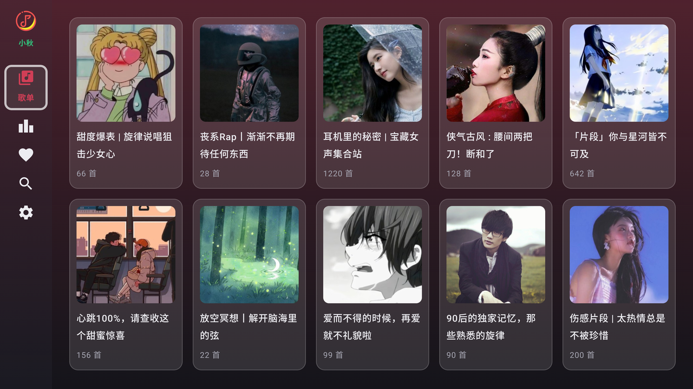

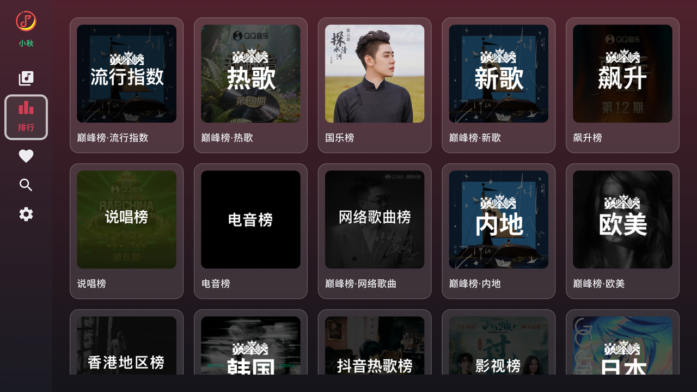

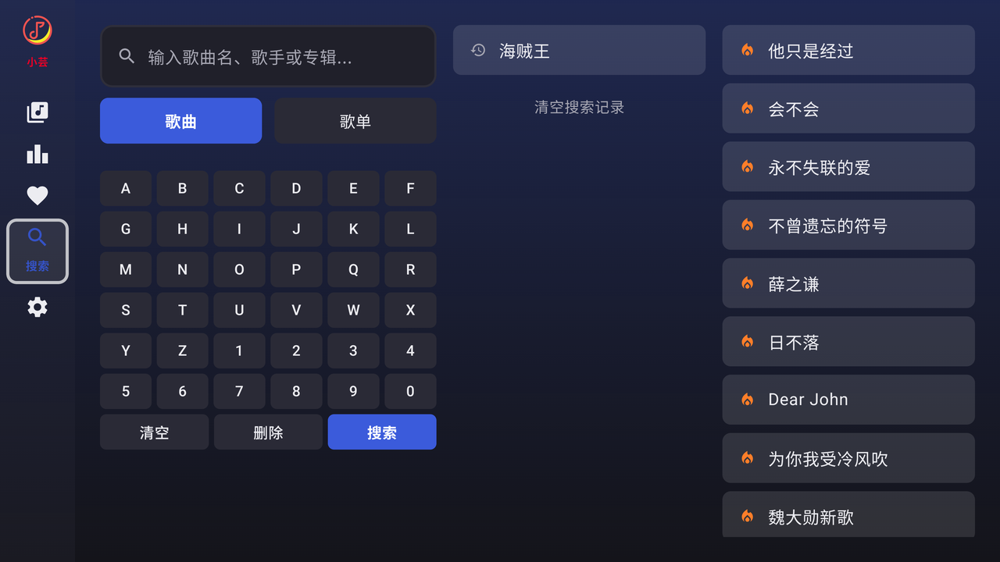

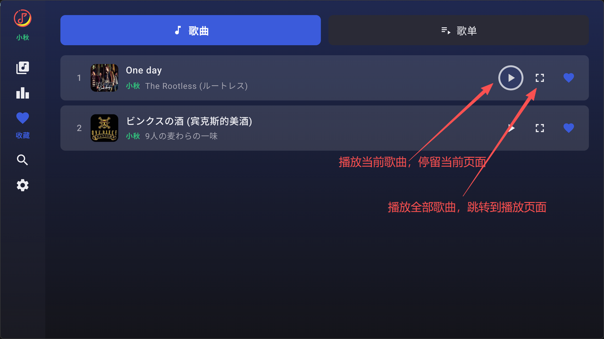

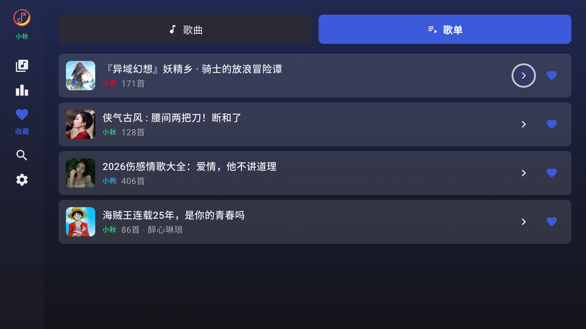

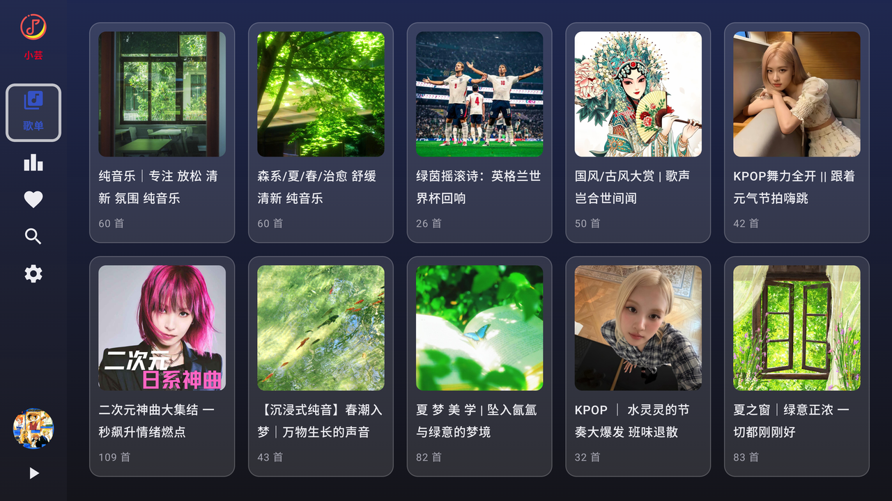

### 设置

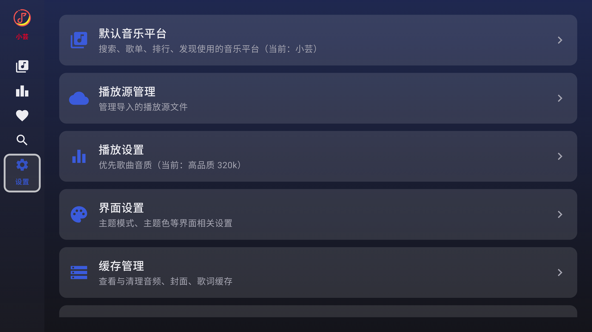

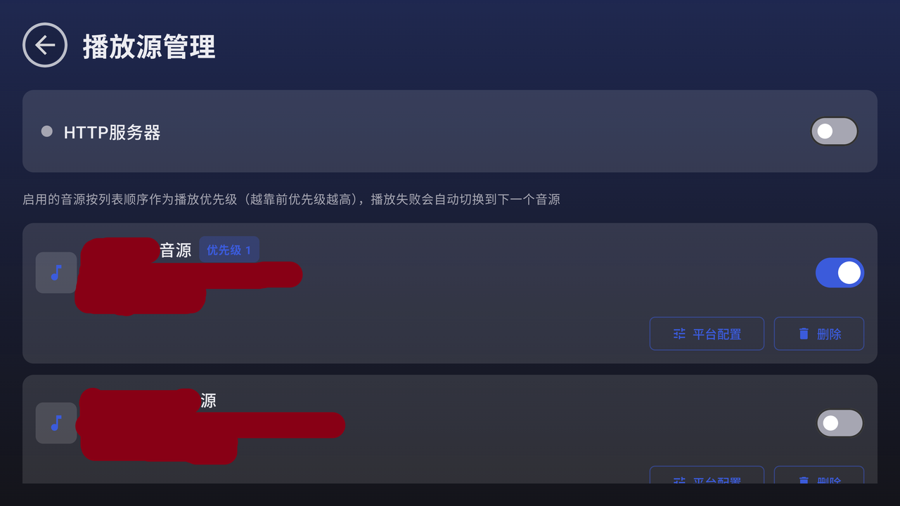

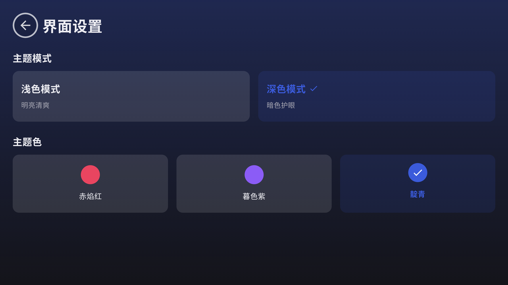

### 播放

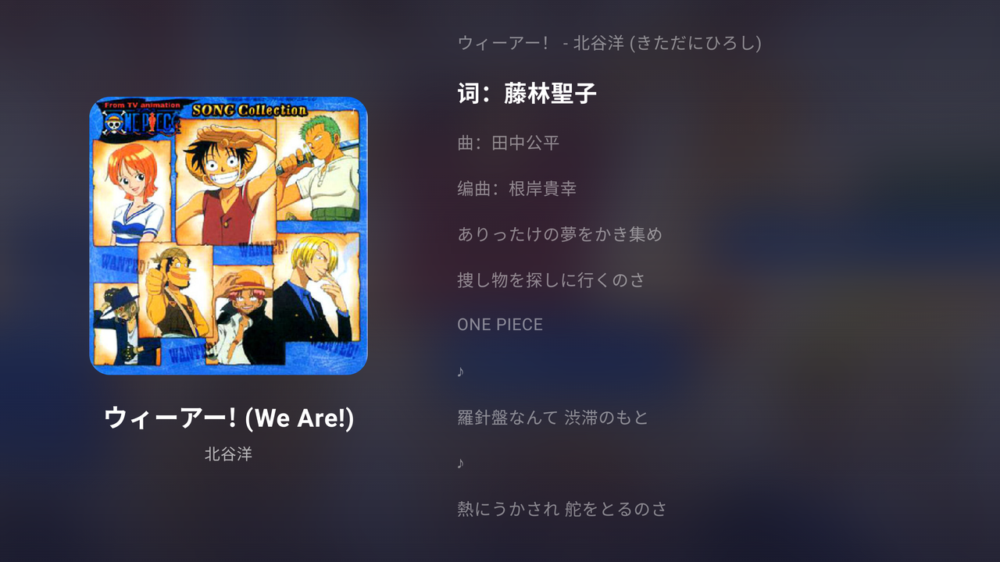

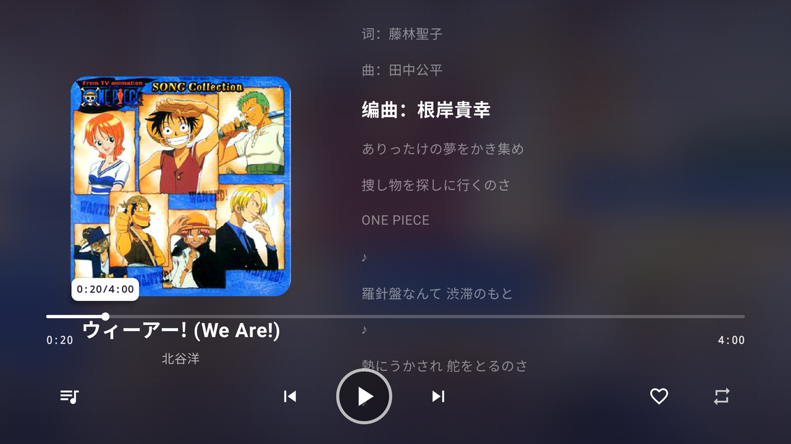

---

## 🎵 功能总览

### 1. 播放源管理
- **洛雪 JS 播放源**：支持导入 lx-music 格式的 JS 播放源
- **Web 端管理**：TV 端启动 HTTP 服务器，手机/电脑浏览器打开地址即可上传、删除播放源，并配置平台生效范围
- **多源优先级**：启用顺序即优先级（越靠前越高），播放失败自动切换到下一个可用源；重启后优先级保持不变
- **平台配置**：每个源可精确指定对哪些音乐平台生效，全部不勾选 = 全平台生效

### 2. 音乐搜索
- **多平台搜索**：内置 API
- **搜索类型**：歌曲 / 歌单
- **搜索联想**：支持首字母搜索联想
- **热门搜索**：多平台热搜接口 + 内置兜底词，始终有内容可点
- **TV 小键盘**：内置 6 列字母数字键盘，遥控器逐键输入，搜索键触发
- **三栏布局**：左键盘 / 中联想 / 右热门，焦点左→中→右严格跳转

### 3. 音乐浏览
- **歌单广场**：按平台浏览热门歌单
- **排行榜**：多平台官方榜单
- 歌单详情：封面 + 歌曲列表 + 一键播放全部

### 4. 播放体验
- **多音源解析**：JS 源获取直链，如果开启多个JS源播放失败时会自动切换下一个源
- **播放队列**：列表播放、上下曲切换、顺序/随机/单曲循环
- **音质选择**：标准 128k / 高品质 320k / 无损 FLAC / Hi-Res（按源支持情况）
- **歌词同步**：多平台歌词接口 + LRC 解析 + 滚动高亮
- **后台播放**：前台服务 + 媒体通知常驻，返回桌面音乐继续；重新进入自动恢复播放卡片与队列
- **TV 进度条**：遥控器左右键 ±10s / 媒体快进快退 ±30s / 触摸点击定位
- **播放列表面板**：右侧队列弹窗，封面 + 序号 + 当前曲目高亮，点击切换

### 5. 收藏
- 歌曲收藏：搜索/浏览/播放页一键 ♥
- 歌单收藏：歌单搜索/广场/排行榜收藏
- 收藏页双栏（歌曲/歌单），歌单内歌曲列表页内展开，返回键退出
- 启动设置里的Http服务器后可通过Web端将各平台歌单导入到收藏歌单列表

### 6. TV 交互细节
- **统一焦点指示**：全界面亮红边框 + 发光，遥控器焦点一目了然（无深蓝底看不清问题）
- **退出确认**：首页返回键弹窗三选（取消/退出/后台播放）
- **屏幕常亮**：播放页抑制屏保与自动锁屏
- **播放历史**：Room 持久化最近播放

---

## 🛠 技术栈

| 类别 | 选型 |
| --- | --- |
| 语言 | Kotlin 2.1.20 |
| UI | Jetpack Compose（Compose BOM 2024.10.01，Material 3） |
| 架构 | MVVM + StateFlow + ViewModel |
| 播放器 | ExoPlayer 2.19.1（含播放缓存 CacheDataSource/SimpleCache） |
| JS 引擎 | QuickJS（wang.harlon.quickjs:wrapper-android:3.2.3） |
| 网络 | OkHttp 5.4.0 / NanoHTTPD 2.3.1（HTTP 服务器） |
| 存储 | Room 2.7.2 + DataStore |
| 构建 | AGP 9.3.0 / Gradle（项目内置 wrapper） |

## 📁 项目结构

```
LXMusicTV/
├── app/src/main/java/com/lxmusic/tv/
│   ├── MainActivity.kt          # 导航 + 状态编排
│   ├── LXMusicApplication.kt
│   ├── data/
│   │   ├── database/            # Room 实体 / DAO / 迁移
│   │   ├── model/               # 领域模型（MusicSource / Song / Playlist...）
│   │   ├── source/              # SourceManagerImpl / MusicSearchService / BrowseDataService
│   │   │                         # ScriptParser / SearchSuggestEngine / KwCrypto
│   │   └── storage/             # DataStoreManager
│   ├── network/                 # HttpClient / 各平台 API（Kugou/Kuwo/QQ/Netease/NeteaseWeApi）
│   ├── presentation/
│   │   ├── screen/              # MainScreen / SearchScreen / SearchResultScreen
│   │   │                         # FavoritesScreen / PlayerScreen / SourceManagementScreen / TvKeyboard
│   │   ├── component/           # FocusIndicators（统一焦点样式）/ RemoteImage
│   │   ├── lyrics/  theme/  animation/
│   │   └── ...                  
│   ├── script/                  # JavaScriptEngine（QuickJS 封装）/ SourceExecutor
│   ├── service/
│   │   ├── player/              # PlayerService（前台播放服务）
│   │   └── http/                # NanoHTTPD Web 管理服务器
│   └── viewmodel/               # MainViewModel
└── build.gradle.kts
```

## 📺 遥控器操作指南

| 场景 | 操作 |
| --- | --- |
| 全局导航 | 方向键移动焦点，确认键进入/播放，返回键返回上一级 |
| 搜索页 | 键盘区域逐个按键输入；行尾键右键→联想→热门；搜索键确认搜索 |
| 播放页（2.0） | 「下键」弹出控制栏：进度条聚焦时左右键 ±10s / 媒体键 ±30s；按键排左右导航；「上键」收起控制栏；返回键退出 |
| 播放模式 | 循环按钮循环切换 顺序→随机→单曲循环 |
| 首页返回 | 弹出退出确认（取消/退出/后台播放），「后台播放」返回桌面音乐继续 |
| 播放源管理 | 服务器开关 + 音源启用开关（带优先级徽标），Web 端上传新源 |


## 🔧 构建

### 环境要求
- Android Studio（新版）+ Android SDK 35
- JDK 17+
- Gradle 9.5.0（项目内置 wrapper）

### 步骤
1. 克隆 / 打开项目
2. 同步 Gradle
3. 连接 Android TV 设备（或电视盒子，开启 ADB）
4. `./gradlew :app:installDebug` 或 Android Studio 直接 Run

### 已知问题
1. 小秋音乐平台部分歌单无法打开，实测是QQ音乐接口问题  
2. 小蜜音乐平台未经过测试，可能存在某些界面请求失败或者无法播放的问题  
3. 搜索联想功能经过实测后全部平台统一使用小芸音乐的接口，但是还是有时候需要输入全拼才能出现正确联想（比如想要搜索”海贼王“时输入“HZW”无效，得输入“HAIZE”才出现“海贼王”，有些则只需输入首字母即可）
4. 歌词翻译功能目前只有小芸音乐平台生效  

## 📄 项目协议

本项目基于 Apache License 2.0 许可证发行，以下协议是对于 Apache License 2.0 的补充，如有冲突，以以下协议为准。

词语约定：本协议中的“本项目”指 LX Music TV项目；“使用者”指签署本协议的使用者；“官方音乐平台”指对本项目内置的包括酷我、酷狗、咪咕等音乐源的官方平台统称；“版权数据”指包括但不限于图像、音频、名字等在内的他人拥有所属版权的数据。

一、数据来源  
1.1 本项目的各官方平台在线数据来源原理是从其公开服务器中拉取数据（与未登录状态在官方平台 APP 获取的数据相同），经过对数据简单地筛选与合并后进行展示，因此本项目不对数据的合法性、准确性负责。

1.2 本项目本身没有获取某个音频数据的能力，本项目使用的在线音频数据来源来自软件设置内“自定义源”设置所选择的“源”返回的在线链接。例如播放某首歌，本项目所做的只是将希望播放的歌曲名、艺术家等信息传递给“源”，若“源”返回了一个链接，则本项目将认为这就是该歌曲的音频数据而进行使用，至于这是不是正确的音频数据本项目无法校验其准确性，所以使用本项目的过程中可能会出现希望播放的音频与实际播放的音频不对应或者无法播放的问题。

1.3 本项目的非官方平台数据（例如“我的列表”内列表）来自使用者本地系统或者使用者连接的同步服务，本项目不对这些数据的合法性、准确性负责。

1.4 本项目没有内置任何自定义源；

二、版权数据  
2.1 使用本项目的过程中可能会产生版权数据。对于这些版权数据，本项目不拥有它们的所有权。为了避免侵权，使用者务必在 24 小时内 清除使用本项目的过程中所产生的版权数据。

三、音乐平台别名  
3.1 本项目内的官方音乐平台别名为本项目内对官方音乐平台的一个称呼，不包含恶意。如果官方音乐平台觉得不妥，可联系本项目更改或移除。

四、资源使用  
4.1 本项目内使用的部分包括但不限于字体、图片等资源来源于互联网。如果出现侵权可联系本项目移除。

五、免责声明  
5.1 由于使用本项目产生的包括由于本协议或由于使用或无法使用本项目而引起的任何性质的任何直接、间接、特殊、偶然或结果性损害（包括但不限于因商誉损失、停工、计算机故障或故障引起的损害赔偿，或任何及所有其他商业损害或损失）由使用者负责。

六、使用限制  
6.1 本项目完全免费，且开源发布于 GitHub 面向全世界人用作对技术的学习交流。本项目不对项目内的技术可能存在违反当地法律法规的行为作保证。

6.2 禁止在违反当地法律法规的情况下使用本项目。 对于使用者在明知或不知当地法律法规不允许的情况下使用本项目所造成的任何违法违规行为由使用者承担，本项目不承担由此造成的任何直接、间接、特殊、偶然或结果性责任。

七、版权保护  
7.1 音乐平台不易，请尊重版权，支持正版。

八、非商业性质  
8.1 本项目仅用于对技术可行性的探索及研究，不接受任何商业（包括但不限于广告等）合作及捐赠。

九、接受协议  
9.1 若你使用了本项目，即代表你接受本协议。

## 免责声明

> 不得利用本项目进行任何非法活动。 不得干扰官方的正常运营。 不得传播恶意软件或病毒。 此外，为降低法律风险

1. 🚫禁止在官方平台及官方账号区域宣传本项目
2. 🚫禁止利用本项目牟利，本项目无任何盈利行为，第三方盈利与本项目无关

